# Tutorial de Angular, Android Studio, Nodejs e React Native

- [Tutorial de Angular, Android Studio, Nodejs e React Native](#tutorial-de-angular-android-studio-nodejs-e-react-native)
  - [Instalar o Powelevel10k](#instalar-o-powelevel10k)
  - [Instalar o Homebrew](#instalar-o-homebrew)
    - [VSCode Insiders](#vscode-insiders)
    - [Apache](#apache)
    - [PHP](#php)
      - [Trocador rápido de versão de PHP](#trocador-rápido-de-versão-de-php)
      - [Teste final de Grav CMS e de phpMyAdmin](#teste-final-de-grav-cms-e-de-phpmyadmin)
    - [Java](#java)
    - [Nodejs](#nodejs)
  - [Android Studio](#android-studio)
  - [Xcode](#xcode)
  - [VSCode](#vscode)
    - [Apache](#apache-1)
    - [Atalhos](#atalhos)
    - [Autocompletações](#autocompletações)
    - [CSS, HTML, SASS e SCSS](#css-html-sass-e-scss)
    - [Markdown](#markdown)
    - [React Native](#react-native)
    - [Outos](#outos)
    - [Tema](#tema)

## Instalar o Powelevel10k

Desde Mojave 10.14, o Zsh passou a tornar-se um novo padrão no terminal padrão da Apple, então não precisa instalar o Zsh via Homebrew. Instala a partir do repositório no Github:

```zsh
git clone --depth=1 https://github.com/romkatv/powerlevel10k.git ~/.powerlevel10k
```

Antes de incluir este último comando, precisamos instalar as fontes nerd Fontes antes. Indicamos as fontes San Francisco da Apple com ícones de Nerd Fonte incluídos. Bastamos clonar e instalar directamente na pasta `$HOME/Library/Fonts`:

```zsh
git clone https://github.com/epk/SF-Mono-Nerd-Font.git "$HOME/Library/Fonts/SF Nerd Fonts"
```

Muda a fonte do terminal da Apple. Clica em Terminal na barra de menu ao lado do ícone de maçã, e seleciona Preferências:

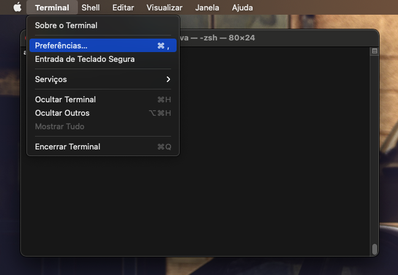

Seleciona o ícone de perfis:

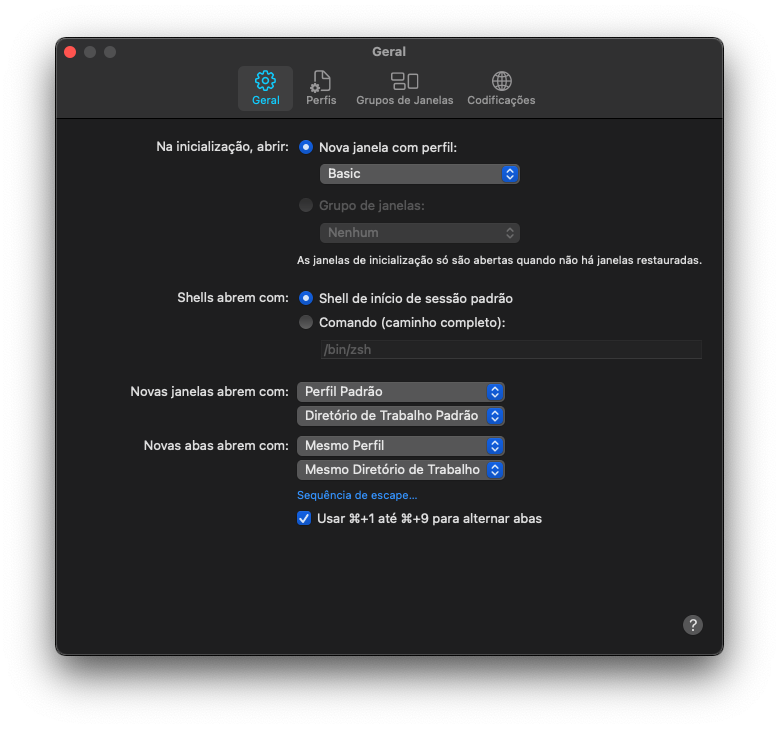

Clica em “Trocar…”:

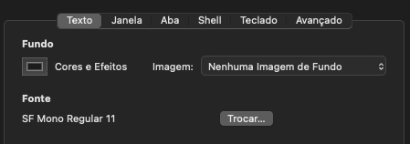

Selecciona “SFMono Nerd Font”:

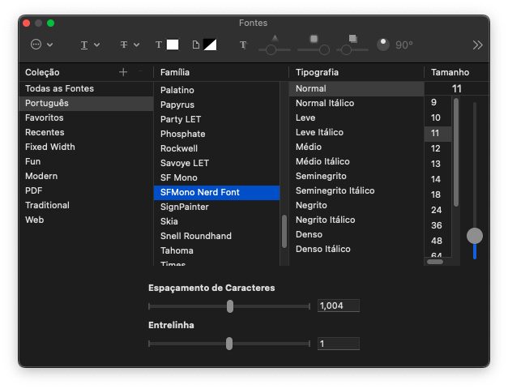

Podes fechar a janela, vamos realizar a inclusão da importação do tema:

```zsh
echo 'source ~/.powerlevel10k/powerlevel10k.zsh-theme' >>~/.zshrc
```

Fecha o terminal e reabre-o. Powerlevel10 vai pedir para tu configurares e escolheres o estilo que desejas. 

## Instalar o Homebrew

1. Primeiramente instalemos os comandos de linha do Xcode:

	```zsh
	xcode-select --install
	```

2. Começa primeiramente a instalar o Homebrew:

	```zsh
	/bin/bash -c "$(curl -fsSL https://raw.githubusercontent.com/Homebrew/install/HEAD/install.sh)"
	```

3. E instale alguns pacotes importantes, inclusive Apache, MariaDB, Nodejs, PHP e Python com PIP:

	```zsh
	brew install curl httpd mariadb micro nodejs openssl php python wget
	```
	
4. Também instala as duas versões PHP & e PHP 8 (já instalado antes no item anterior):

	```zsh
	brew install shivammathur/php/php@7.4
	```

5. Enquanto a maioria dos programadores de PHP ainda não evoluírem os seus projectos para PHP 8, devemos depender de PHP 7 no momento. Vamos executar a religar a versão de PHP 7:

	```zsh
	brew unlink php && brew link --overwrite --force php@7.4
	```

Pronto, vamos em seguida para instalar o VSCode Insiders.

### VSCode Insiders

```zsh
brew install --cask visual-studio-code
```

### Apache

1. Primeiramente desliguemos o Apache:

	```zsh
	sudo apachectl stop
	sudo launchctl unload -w /System/Library/LaunchDaemons/org.apache.httpd.plist 2>/dev/null
	```

2. Agora vamos iniciar o Apache que instalamos do Homebrew:

	```zsh
	brew services start httpd
	```

1. Vamos configurar o Apache e restaurá-lo:

	```zsh
	code /usr/local/etc/httpd/httpd.conf
	```

3. Localiza `Listen 8080` e muda para `Listen 80`;
4. Localiza `DocumentRoot "/usr/local/var/www”`, e muda para `DocumentRoot /Users/alansilva/Sites`;
5. Também muda de `<Directory "/usr/local/var/www">` para `<Directory "DocumentRoot /Users/alansilva/Sites">`;
6. Dentro da mesma linha `<Directory "DocumentRoot /Users/alansilva/Sites">`, muda de `AllowOverride None` para `AllowOverride All`;
7. Localize `LoadModule rewrite_module lib/httpd/modules/mod_rewrite.so` e remove o símbolo `#` para descomentá-lo;
8. Localize `User _www` e muda assim para:

   ```zsh
   User alansilva
   Group staff
   ```

9. Localiza `#ServerName www.example.com:8080` e muda para `ServerName localhost` com o símbolo `#` removido;
10. Crie uma pasta e um ficheiro chamado `index.html`, a executar o comando no terminal:

    ```zsh
    mkdir ~/Sites
    touch ~/Sites/index.html`
    ```

11. Abre o ficheiro com o comando `code ~/Sites/index.html`;
12. Copia e cola dentro do ficheiro:

    ```html
    <h1>Sou Alan</h1> 
    
    ```

    Guarda o 0ficheiro e fecha.

13. Vamos parar e reiniciar o Apache:

    ```zsh
    brew services stop httpd
    brew services start httpd
    ```

14. Testa ao clicar http://localhost/ e voici!

### PHP

Vamos voltar a configurar novamente o Apache para que PHP funcione. Prossigamos com o mesmo ficheiro `/usr/local/etc/httpd/httpd.conf`.

1. Localiza `LoadModule rewrite_module lib/httpd/modules/mod_rewrite.so`, e abaixo deste módulo, adere os seguintes módulos `libphp`:

   ```apache
   LoadModule php7_module /usr/local/opt/php@7.4/lib/httpd/modules/libphp7.so
   # LoadModule php_module /usr/local/opt/php@8.0/lib/httpd/modules/libphp.so
   ```

2. Localiza este bloco:

   ```apache
   <IfModule dir_module>
       DirectoryIndex index.html
   </IfModule>
   ```

   Substitui por:

   ```apache
   <IfModule dir_module>
    DirectoryIndex index.php index.html
   </IfModule>

   <FilesMatch \.php$>
       SetHandler application/x-httpd-php
   </FilesMatch>
   ```

3. Finaliza o comando `brew services stop httpd && brew services start httpd ` com a paragem e a reinicialização de Apache.
4. Cria um ficheiro em PHP naquela mesma pasta:

   ```zsh
   echo "<?php phpinfo();" > ~/Sites/info.php
   ```

5. Cria o outro ficheiro `alan.php` em PHP e abre-o. Eis os comandos seguintes:

   ```zsh
   touch ~/Sites/alan.php
   code ~/Sites/alan.php
   ```

6. Copia e cola:

   ```php
   <?php $nome = "Alan"; $descricao = "Kirk, o Expurgador no filme Forever Purge"; ?>

   <h1>Sou <?php echo $nome ?></h1>
   <h2><?php echo $descricao ?></h2>

   " src="https://64.media.tumblr.com/e06c2cb44860c2e15bb451c56c563153/506551287e29d076-f9/s540x810/ac85a551e84e913bc57c67fe2cb4f6379e1fba45.gif">
   ```

7. Experimenta ao clicar em http://localhost/info.php e http://localhost/alan.php, vê se funcionam!

#### Trocador rápido de versão de PHP

Para facilitar a troca de versão de PHP para 7.4 ou 8, temos um programa executável chamado `sphp`. Instalemos no `/usr/local/bin` padrão do Homebrew no terminal:

```zsh
curl -L https://gist.githubusercontent.com/rhukster/f4c04f1bf59e0b74e335ee5d186a98e2/raw/0c36a5067fbd63e6a36700a6aaa119df0836bdfc/sphp.sh > /usr/local/bin/sphp
chmod +x /usr/local/bin/sphp
```

Analisa se `/usr/local/bin` existe nas importações de `PATH` com o comando:

```zsh
echo $PATH
```

Se `/usr/local/bin` está listado, podes ignorar este passo seguinte.

Se não está listado, coloca `export PATH=/usr/local/bin:/usr/local/sbin:$PATH` no ficheiro `~/.zshrc` para exportar o novo caminho `/usr/local/bin`. 

Basta trocar com este comando

```zsh
# Para 7.4
sphp 7.4

# Para 8
sphp 8
```

#### Teste final de Grav CMS e de phpMyAdmin

Vamos entrar na pasta `Sites` e transferir e extrair o pacote:

```zsh
cd ~/Sites

# Grav CMS
curl -OJL https://getgrav.org/download/core/grav-admin/latest
unzip grav-admin*.zip

# phpMyAdmin
curl -OJL https://files.phpmyadmin.net/phpMyAdmin/5.1.1/phpMyAdmin-5.1.1-all-languages.zip
unzip phpMyAdmin*.zip
mv phpMyAdmin* phpmyadmin
```

Experimenta ao testar com http://localhost/grav-admin e http://localhost/phpmyadmin !

### Java

1. Primeiramente instalemos os *casks* do Homebrew:

   ```zsh
   brew tap homebrew/cask-versions
   brew update
   brew tap homebrew/cask
   ```

2. Instalemos a mais recente versão de Java, isto é, versão 17. 

   ```zsh
   brew install java
   ```

   Primeiramente executa o comando `sudo ln -sfn /usr/local/opt/openjdk/libexec/openjdk.jdk /Library/Java/JavaVirtualMachines/openjdk.jdk` no terminal. 

3. Instalemos as versões especifícas de Java:

   - 8
   - 11
   - 15
   - 17
  
   ```zsh
   brew tap adoptopenjdk/openjdk
   brew install adoptopenjdk/openjdk/adoptopenjdk8
   brew install adoptopenjdk/openjdk/adoptopenjdk11
   brew install adoptopenjdk/openjdk/adoptopenjdk15
   ```

4. Vamos colocar as exportacões no ficheiro `~/.zshrc` e podemos trocar de versão rapidamente, com o comando `micro ~/.zshrc`. 

   ```zsh
   export PATH="/usr/local/opt/openjdk/bin:$PATH"

   export JAVA_8_HOME=$(/usr/libexec/java_home -v1.8)
   export JAVA_11_HOME=$(/usr/libexec/java_home -v11)
   export JAVA_15_HOME=$(/usr/libexec/java_home -v15)
   export JAVA_17_HOME=$(/usr/libexec/java_home -v17)

   alias java8='export JAVA_HOME=$JAVA_8_HOME'
   alias java11='export JAVA_HOME=$JAVA_11_HOME'
   alias java15='export JAVA_HOME=$JAVA_15_HOME'
   alias java17='export JAVA_HOME=$JAVA_17_HOME'

   # default to Java 11
   java11
   ```

### Nodejs

Recomendamos a utilizar Yarn, pois podes fazer backup de pastas importantes para o repositório *dotfiles* no Github ou no GitLab. 

1. Instalemos `yarn` via `npm`:

   ```zsh
   npm i -g yarn
   ```

2. Instalaremos alguns pacotes fixes:

   ```zsh
   yarn global add @angular/cli csscomb fexfetch gatsby gatsby-cli gtop gulp-cli http-server sass typescript
   ```

3. Comecemos com o Reactive Native ao adicionar o pacote Expo CLI:

   ```zsh
   yarn global add expo-cli
   ```

   Para iniciar o projecto, precisamos instalar e configurar primeiramente o Android Studio e o XCode.

## Android Studio

1. Podemos instalar o Android Studio via Homebrew no terminal, sem termos de ir directamente ao site do Google:

   ```zsh
   brew install android-studio
   ```

2. Cria uma pasta com um ponto para escondê-la do Finder para instalar o SDK e os componentes de Android:

   ```zsh
   mkdir ~/.android-sdk
   ```

3. Abre o Android Studio, receberás o diálogo... Seleciona «Do not import settings":

   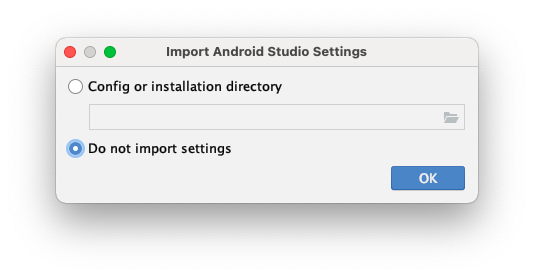

4. O outro diálogo chato aparecerá. Selecciona «Don't send»:

   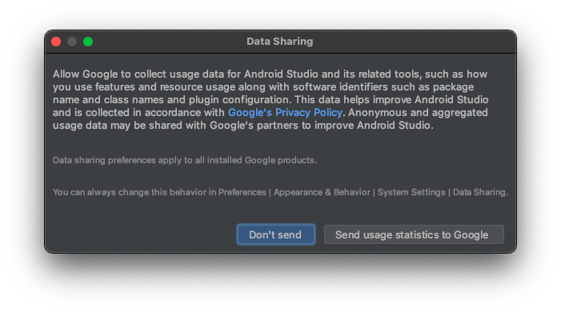

5. Ao começar, clica em «Next». 
6. Na etapa seguinte, escolhe o tipo de instalaão – «Custom».

   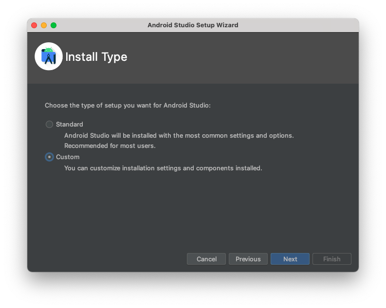

7. Deixe desta forma mesmo:

   

8. Recomendamos o tema «Darcula»:

   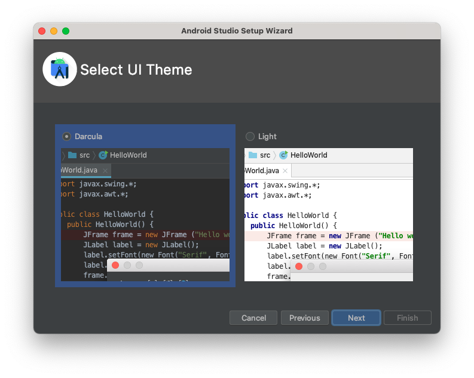

9. No diálogo de configuração de componentes de Android, no rótulo «Android SDK location», vamos mudar de para `/Users/alansilva/.android-sdk`. Selecciona todos os componentes:

   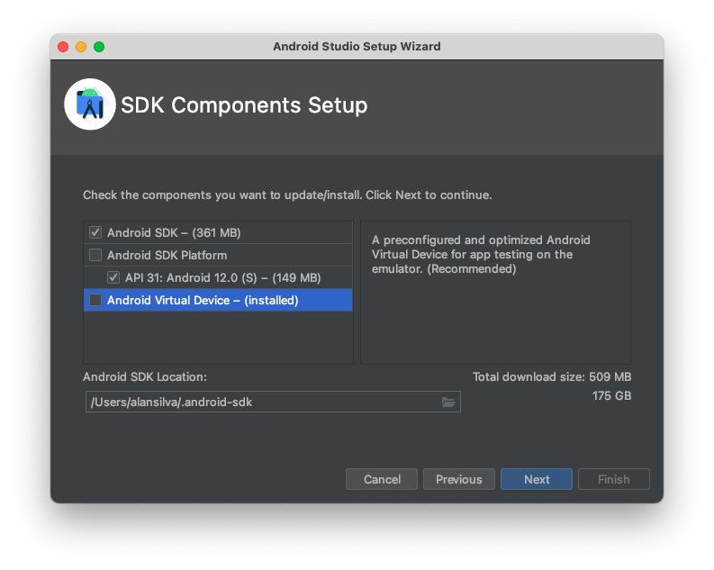

   Na etapa final, clica em «Finish». 

10. Clica em «Project» e então em «More actions» e selecciona «SDK Manager»:

   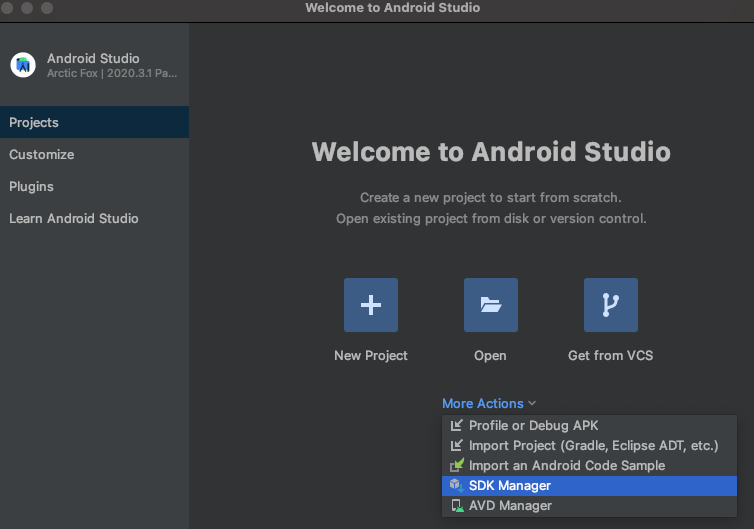

11. Selecciona a aba «SDK Tools» e marca as ferramentas:

   - NDK
   - Android SDK Command-line Tools
   - CMake
   - Google PLay APK Expansion LIbrary
   - Google Play INstant Development SDK
   - Google Play Licensing Library
   - Google Play Services
   - Google Web Driver
   - Intel x86 Emulator Accelerator (HAXM installer)

   

   Selecciona «Apply», receberás outro diálogo, então clica em «OK». 

12. Selecciona «Accept» em todas as ferramentas e então «Next». Agora deve estar a instalar. 
13. Selecciona 4GB no diálogo de HAXM com o rótulo «Emulator Settings»:

   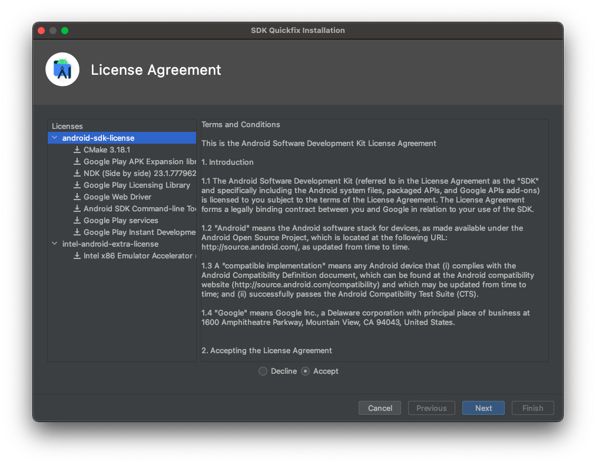

   Ao terminar a instalaão, clica em «Finish». Fecha a janela de configuracões. 

14. Ao fechar a janela de configurações, estarás na janela de boas-vindas, em que também deves clicar novamente «More actions», então selecciona «AVD Manager».
15. Clica em «+ Create Virtual Device...»:

   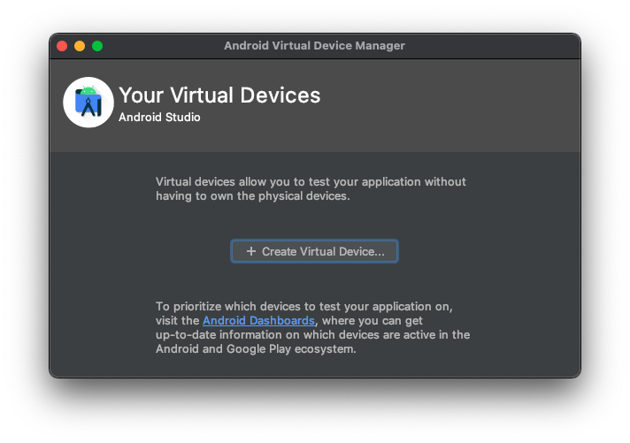

16. Escolhe `Pixel 4` e clica em «Next»:

   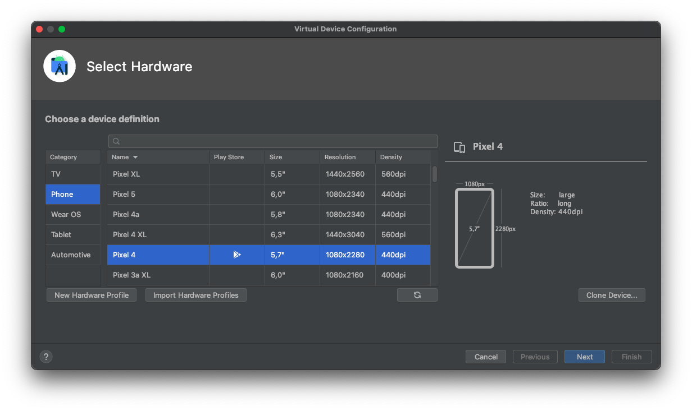

17. Selecciona as versões Oreo, Pie, Q e R (estas versões têm maiores percentagens de utilizadores do que as versões 4 a 7) e clica em «Download» destas versões:

   

   Escolhe R e ntão clica em «Next». 

18. Deixa as configuracões desta maneira:

   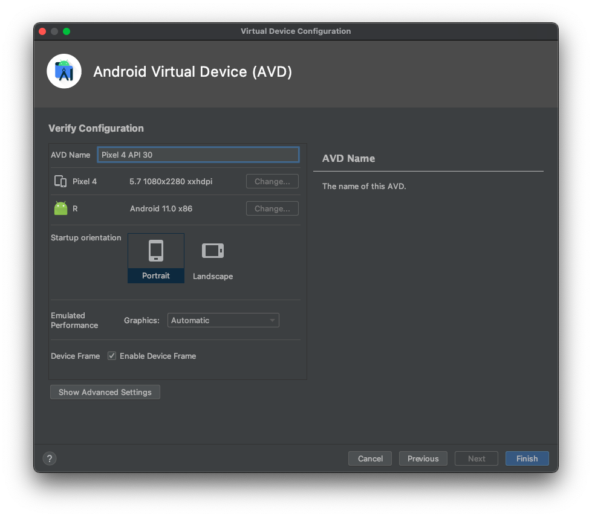

19. Repete o item 15, mas escolhe Pixel 4 e Pie. Agora podes escolher um dos emuladores para testar e ver se funcionar. 
20. Se funcionar, vamos colocar as exportações dos comandos do Android SDK. Abre o ficheiro `~/.zshrc` com o comando:

   ```zsh
   code ~/.zshrc
   ```

   Copia o código abaixo:

   ```zsh
    # Android Studio
    export ANDROID_HOME=$HOME/.android-sdk
    export PATH=$PATH:$ANDROID_HOME/emulator:$PATH
    export PATH=$PATH:$ANDROID_HOME/tools:$PATH
    export PATH=$PATH:$ANDROID_HOME/tools/bin:$PATH
    export PATH=$ANDROID_HOME/platform-tools:$PATH
   ```

21. Agora, vamos criar o novo projecto e entrar nele com estes comandos seguinte:

   ```zsh
   npx react-native init ProjectoAlan
   cd ProjectoAlan
   ```

22. Então executa o comando `npx react-native run-android`. Abrir-se-á o emulador de Android e o aplicativo do Expo/rEact native deverá ser aberto automaticamente no emulador. Funcionou? Congratulações!

## Xcode

1. Instala o Xcode da Mac App Store. 
2. Para instalar as ferramentas de linha de comando do Xcode, abre o Xcode, então escolhe «Preferências ...» no menu Xcode (ou pressione <kbd>⌘</kbd> + <kbd>,</kbd>). Vai para o painel `Locations` e instala as ferramentas selecionando a versão mais recente no menu suspenso rotulado «Command Line Tools»:

   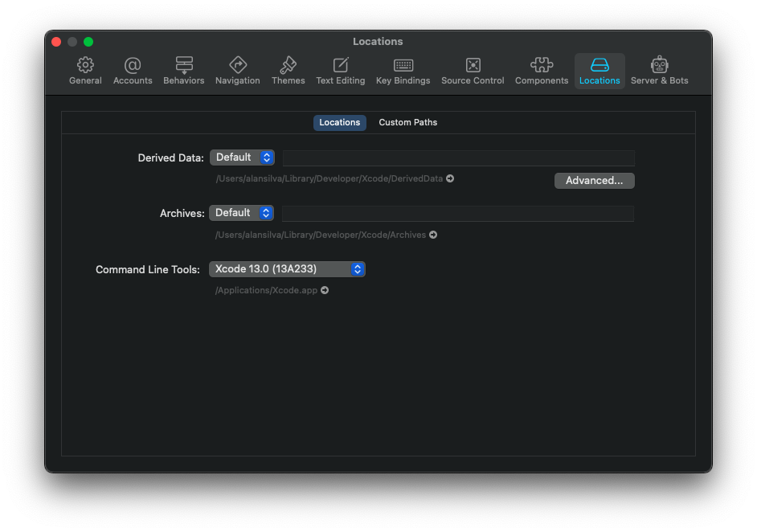

3. Antes de testar, precisamos instalar o Ruby via Homebrew, então CocoaPOds via Ruby e poucos pacotes via `npm` ou `yarn` (recomendamos totalmente):

   Instala o Ruby via Hombrew

   ```zsh
   brew install ruby
   ```

   E adicionar a exportação do Ruby ao ficheiro `~/.zshrc`:

   ```zsh
   export PATH="/usr/local/opt/ruby/bin:$PATH"
   ```

   Então instala CocoaPods via Ruby:

   ```zsh
   sudo gem install cocoapods
   ```

   Instala o pacote `watchman` via Homebrew:

   ```zsh
   brew install watchman
   ```

4. Como já tinhas iniciado o projecto no item anterior de [Android Studio](#android-studio), entrada na pasta `ProjectoAlan` e executa o comando `npx react-native run-ios`. Funcionou? Congratulações!

## VSCode

Preparamos a lista de extensões recomendadas para tu trabalhares com Reactive Native. Prime <kbd>⌘</kbd> + <kbd>p</kbd>:

### Apache
- Apache Configurations
- Apache Configurations Snippets

### Atalhos
- Atom Keymap

### Autocompletações
- Kite
- Path IntelliSense

### CSS, HTML, SASS e SCSS
- Sass
- SCSS IntelliSense

### Markdown
- Markdown Docs da Microsoft
- Markdown All in One
- Markdown Paste
- Markdown Preview GitHub STyling

### React Native
- JavaScript and TypeScript
- React Native Snippets
- React Native Tools

### Outos
- Bracket Pair Colorizer 2
- Colorize
- Indent Rainbow

### Tema
- Dracula
- Material Icon Theme
- Synthwave '84

```zsh
ext install apache 
ext install apacheconf-snippets 
ext install atom-keybindings 
ext install bracket-pair-colorizer-2 
ext install docs-markdown 
ext install dracula-theme.theme-dracula
ext install dsznajder.es7-react-js-snippets 
ext install kite 
ext install markdown-preview-github-styles 
ext install msjsdiag.vscode-react-native
ext install oderwat.indent-rainbow 
ext install path-intellisense
ext install pkief.material-icon-theme
ext install robbowen.synthwave-vscode
ext install syler.sass-indented
ext install vscode-colorize
ext install vscode-markdown-paste-image 
ext install vscode-scss 
ext install vscode-typescript-next 
ext install ymarkdown-all-in-one
```
